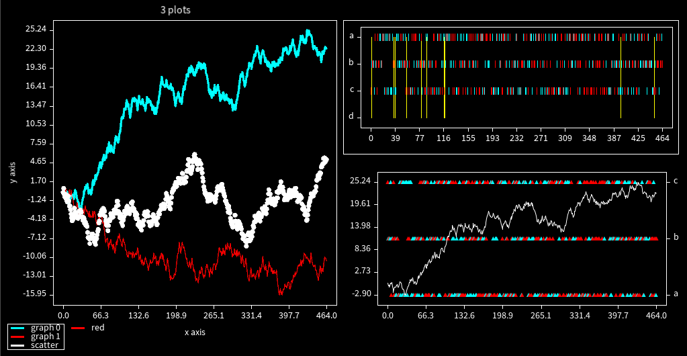

# A set of simple gui elements for py5

# Setup:

* `pip install git+https://github.com/alexanderwallerus/py5-gui@main`
* or after a local download you can within the py5gui folder run:
* `pip install ./`
* Update to the current version with:
* `pip install --force-reinstall git+https://github.com/alexanderwallerus/py5-gui@main`
* py5gui also contains plotting functionalities and an extended print function - print0()

# Quickstart

## Plotting

Example of plotting features:



### basics
- draw a plot in a py5 sketch draw(): function at coordinates 10, 10 with width and height 500, 200
```python
def draw():
    py5.background(0)
    xs = [1,   2, 2.5,   3]
    ys = [0.5, 2,  -1, 0.5]
    plt = py5gui.Plot(x=10, y=10, w=500, h=200)
    plt.plot(xs, ys)
    plt.show()
```
- The py5gui.Plot object can be created outside of the draw() loop (i.e. in `def setup():` and reused for efficiency if needed.
- numpy arrays can also be provided to .plot()

### You can also plot your data as a one-liner
```python
py5gui.Plot(x=10, y=10, w=500, h=200).plot(xs, ys).show()
```
- you can chain further .plot(), .scatter() and .axvline() before .show()

### animating/updating plots
```python
def draw():
    py5.background(0)
    xs = [0]
    ys = [0]
    py5gui.Plot(x=10, y=10, w=500, h=200).plot(xs, ys).show()
    xs.append(py5.frame_count)
    # add values as a random walk. As the next value use the last value + a random value between -1 and +1.
    ys.append(ys[-1] + py5.random(-1.0, 1.0))
```
- in this example we provide updated xs and ys lists to the plot every draw loop iteration
- the plot will automatically autoscale to fit the range of values
  - You can provide a fixed y range for your plots by setting [ylimits](#set-the-y-axis-range-between-0-and-3)
- .show() not only plots the data provided through calls to .plot(), .scatter(), .axvline() but also resets it in case plot object is to be reused

### scatter plots
```python
plt.scatter(xs, ys)
```
- use .scatter() instead of .plot() or in addition to plot both datasets

### vertical lines
```python
vertical_line_positions = [0, 100, 200, 300]
plt.axvline(vertical_line_positions)
```

### title, xlabel, ylabel
```python
plt.show(title='title text', xlabel='xlabel text', ylabel='ylabel text')
```

### colors, weights and markers
```python
# draw a red graph
plt.plot(a_xs, a_ys, color=(255, 0, 0))
# draw a grey axvline
plt.axvline(vertical_line_positions, color=(127, 127, 127))
# draw a grey graph with 3x as strong lines
plt.plot(b_xs, b_ys, color(127, 127, 127), stroke_weight=3)

# draw a a specific color for each datapoint
c_xs = [ 50, 75, 120]
c_ys = [-50, 50,   0]
c_colors = [(0, 255, 255), (255, 255, 0), (0, 255, 255)] # cyan, yellow, cyan
plt.scatter(c_xs, c_ys, color=c_colors)

# draw scatter plots with different marker icons
plt.scatter(a_xs, a_ys, marker='triangle')
plt.scatter(b_xs, b_ys, marker='line')
```
- you can also provide a list of data-point-specific colors to .plot() and .axvline() - not just .scatter()
  - this is a useful way to add a visual category information to your data points
- extra options for scatter plots:
  - marker types: `circle`, `line`, `cross`, `square`, `triangle`
  - `marker=` can also receive a string/character (i.e. 'o', '+', '*')
  - `stroke_weight=` also controls the thickness of the line and cross markers. `diameter=` can control the size of square and circle markers,

### multiple plots in the same space
```python
    plot0_xs = [0,  1, 2]
    plot0_ys = [0, -1, 1]
    
    plot1_xs = [-0.75, -0.25, 0.25, 0.75]
    plot1_ys = [ 0.5,  -0.5,  0.5, -0.5 ]

    scatter_xs = [0.5,  0.75,  1.0 ]
    scatter_ys = [0.75, 0.25, -0.25]

    vlines = [1.5] # only 1 at position x=1.5

    plt = py5gui.Plot(x=10, y=10, w=500, h=200)
    plt.plot(plot0_xs, plot0_ys, color=(255,255,0))   # yellow lines
    plt.plot(plot1_xs, plot1_ys, color=(255,0,255))   # purple lines

    plt.scatter(scatter_xs, scatter_ys)

    plt.axvline(vlines)

    plt.show()
```
- everything added before .show() will end up as part of the plot.
- these plots will all share the same x-y coordinate system - if you have data using a different y-scale or want to mix numerical and categorical data look at [the multiple y-axis section](#multiple-y-axis)
- you can chain .plot().scatter().axvlines().show() if needed

### categorical plots

- for data that maps x values to categorical y instead of a numerical y

```python
event_times = [0, 100, 200, 300, 400, 500]
event_categories = ['a', 'c', 'a', 'b', 'b', 'a']
plt.scatter(event_times, event_categories, order=['a', 'b', 'c', 'd'])
```
- `order=` is optional and allows controling the order of events top to bottom.
  - all categories within order will be included - this is useful for consistent plots when categories i.e. here 'd' don't always happen
- `color=` can also be used to strengthen the information.
- alternatively `color=` can be used in non-categorical plots to color individual datapoints by a category
- You can mix numerical and categorical plots by using multiple y-axis, i.e. numerical data on `yaxis=0` and categorical data on `yaxis=1`

### multiple y-axis

```python
xs_ax0 = [0,   1,  2,  3]
ys_ax0 = [20, 25, 15, 25]

xs_ax1 = [ 0.1,   0.9,   2.2,  3.1]
ys_ax1 = [ 0.04,  0.15, -0.09, 0.21]

plt.plot(xs_ax0, ys_ax0, yaxis=0, color=(0, 255, 255))
plt.plot(xs_ax1, ys_ax1, yaxis=1, color=(255, 0, 255))
plt.show()
```
- adding an axis is useful when data happens in the same x range i.e. same time interval, but is disparate in its numererical range
- each axis can be numerical or categorical allowing you to combine those 2 types of data in one plot
- axis 1 can receive its own set of optional scale configurations during plotting: `ylimit_1=`, `autoscale_in_ylimits_1=`, `y_decimals_1=`
- like with the default yaxis=0, many plots can be plotted together within the yaxis=1
- currently up to 2 y-axis yaxis=0 and yaxis are supported

### render to py5image instead of into the sketch
```python
img = plt.show(to_py5image=True)
# draw the image onto some coordinates
py5.image(img, 10, 10)
```
- instead of directly plotting into the sketch you can plot into a py5image that can be reused or saved with more flexibility.

### set the y axis range between 0 and 3
```python
plt.show(ylimit=[0, 3])
```
- values outside the range will be clipped
- you can also use only oen limit and leave the other as None)

### when using ylimit, autoscale within the provided limits
```python
plt.show(ylimit=[0, 3], autoscale_in_ylimits=(True,True))
```
- currently autoscaling will still happen within an axis ylimit unless both limits are provided
- the 2nd boolean is for a 2nd y axis if one is being used

### define the py5 sketch to be used in py5 class-mode multi-sketch applications
```python
my_sketch = self
py5gui.Plot(x=10, y=10, w=500, h=200, sketch=my_sketch)
```
### plot legends
```python
py5gui.legend({'graph 0': (0, 255, 255), 'graph 1': (255, 0, 0)}, 10, 10)
```
- the fist argument is a color-lookup dictionary of labels and colors, the 2nd and 3rd are the x and y coordinates to draw the legend
- optional arguments
  - `horizontal=False` to draw the legend items vertically
  - `frame=False` to not draw a boundary rectangle
  - `img = py5gui.legend(..., to_graphics=True)` allows rendering the legend into a py5image like with the [plot analog](#render-to-py5image-instead-of-into-the-sketch)
  - `sketch=` to specify a py5 sketch like with the [plot analog](#define-the-py5-sketch-to-be-used-in-py5-class-mode-multi-sketch-applications)

### further customization
- `plt.show(x_decimals=0, y_decimals=2, y_decimals_1=0)` override the automatic number of decimal places on the respective axis
- `plt.show(show_outlines=True)` draw a boundary around the plot